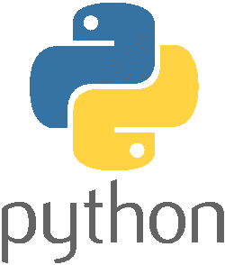

<link rel='stylesheet' href='assets/css/main.css'/>

# Python Labs

## Lab Environment

Instructor will provide access to lab environment

## Notes

* During this class we will use **Jupyter Notebook** and Vscode to write our codes.
* Labs are **designed** to be executed on Ubuntu and Jupyter notebook, working on Windows might require some modifications as python works best on Linux.

## Labs

### Python Basics

### Install

* [Install Python and Vscode on Windows](setup/vscode-python-windows-install.md)

#### Hello World

* [Python in shell](helloworld/REPL.md)
* [Running with Script file](helloworld/Script.md)

#### Language Basics

* [Types](languageBasics/types.ipynb)
* [Conditionals](languageBasics/conditionals.ipynb)
* [Loops](languageBasics/loops.ipynb)
* [Functions](languageBasics/functions.ipynb)

* [String](languageBasics/3.5-string.md)
* [Files](languageBasics/3.6-files.md)
* [OOP](languageBasics/7-oop.md)

4. [Numpy](archive/numpy)/

    * [1-numpy-intro.ipynb](archive/numpy/1-numpy-intro.ipynb)
5. [Pandas](pandas)/

    * [1-pandas-intro.ipynb](archive/numpy/1-pandas-intro.ipynb)
    * [2-pandas-exploration.ipynb](archive/numpy/2-pandas-exploration.ipynb)
6. [Web](web/)

    * [1-setup-dev-env.ipynb](web/6.1-setup-dev-env.ipynb)
    * [2-time-tracker-webservice.ipynb](web/6.2-time-tracker-webservice.ipynb)
    * [3-time-tracker-webclient.ipynb](web/6.3-time-tracker-webclient.ipynb)
7. [Database](database/)

    * [1-databases.ipynb](database/7.1-databases.ipynb)
8. [Deployment](deployment/)

    * [1-dockerfile.md](deployment/8.1-dockerfile.md)
9. [Interop](interop/)
10. [RxPy](rxpy/)
11. [Notebooks](notebooks/)

    * [Learning Notebooks](notebooks/2.2-learning-jupyter.ipynb)
12. [Language Basics](languageBasics/)

    * [Types](languageBasics/3.1-types.ipynb)
    * [Conditionals](languageBasics/3.2-conditionals.ipynb)
    * [Loops](languageBasics/3.3-loops.ipynb)
    * [Functions](languageBasics/3.4-functions.ipynb)
13. [NumPy](archive/numpy/)

    * [Numpy Intro](archive/numpy/1-numpy-intro.ipynb)
14. [Stats](stats/)

    * [Stats Basics](stats/1-stats-basics.ipynb)
    * [Linear Regression](stats/2-lr.ipynb)
    * [Logistic Regression](stats/3-logit.ipynb)
15. [Pandas](pandas/)

    * [Pandas Intro](pandas/1-pandas-intro.ipynb)
    * [Pandas Exploration](pandas/2-pandas-exploration.ipynb)
16. [Visualization](visualization/)

    * [Visualization Intro](visualization/1-viz-intro.ipynb)
    * [Plot Cars](visualization/2-plot-cars.ipynb)
    * [Heat Map](visualization/3-heatmap.ipynb)
    * [ggplot](visualization/4-ggplot.ipynb)
17. [Exploration](exploration/)

    * [Data Cleanup](exploration/1-data-cleanup.ipynb)
    * [Explore House Sales](exploration/2-explore-house-sales.ipynb)
    * [Visualize House Sales](exploration/3-visualize-house-sales.ipynb)
    * [Explore Prosper](exploration/4-explore-prosper.ipynb)
    * [Explore Walmart](exploration/5-explore-walmart.ipynb)
18. [ML with Scikit-Learn](sklearn/)

    * [Scikit-Learn Intro](sklearn/1-sklearn-intro.ipynb)
    * [Scikit Learn Linear Regression](sklearn/2-sklearn-lr.ipynb)
    * [Scikit Learn Clustering Mtcars Dataset](sklearn/3-sklearn-cluster-mtcars.ipynb)
    * [Scikit Learn Clustering NYC Flights Dataset](sklearn/4-sklearn-cluster-nycflights.ipynb)
    * [Scikit Learn Classification NYC Flights Dataset](sklearn/5-sklearn-classify-nycflights.ipynb)
19. [Recommendations](recs/)

    * [Recommendations Movielens](recs/6-recs-movielens.ipynb)
    * [Recommendations Audioscrobble](recs/7-recs-audios.ipynb)

## Related Modules

* [Python Language](./Python-Language.md)
* [Python Text](./Python-Text.md)
* [Python Machine Learning](http://www.github.com/elephantscale/ml-labs-python/README.md)

1. [Text Analysis With NLTK](./text-nltk/)
    * [NLTK Intro](text-nltk/1-nltk-intro.ipynb)
    * [Analyzing Text With NLTK](text-nltk/2-analyzing-text-with-nltk.ipynb)
    * [NLTK Ngrams](text-nltk/3-ngrams.ipynb)
    * [TextBlob](text-nltk/4-textblob.ipynb)
    * [TFIDF](text-nltk/5-tf-idf-intro.ipynb)
2. [Text Analysis With Scikit-Learn](./text-sklearn)
    * [TFIDF Scikit-Learn](text-sklearn/6-tf-idf-with-scikit-learn.ipynb)
3. [Text Analysis With Spacy](./text-sklearn)
    * [Basic Spacy](text-spacy/Basic_Spacy.ipynb)
    * [Spacy Intro](text-spacy/1-spacy-intro.ipynb)
    * [Spacy Feature OVerview](text-spacy/spacy-feature-overview.ipynb)
    * [Spacy Yelp Dataset](text-spacy/spacy-yelp.ipynb)
4. [Text Analysis With Gensim](./text-gensim)
    * [Topic Modeling Intro](text-gensim/7-gensim-intro.ipynb)
    * [Topic Modeling Newsgroups](text-gensim/8-gensim-newsgroups.ipynb))

## Related Courses

* [Python Language](./Python-Language.md)
* [Python Data Science](./Python-Data-Science.md)
* [Python Machine Learning](http://www.github.com/elephantscale/ml-labs-python/README.md)

1. [Python Language Labs](./Python-Language.md)
2. [Python Data Science Labs](./Python-Data-Science.md)
3. [Python Text Labs](./Python-Text.md)

We also have another python repo which is our ML course which maps closely to the Spark Machine Learning.

This is in the Python ML labs location

1. [Python ML Labs](https://github.com/elephantscale/ml-labs-python/blob/master/README.md)
